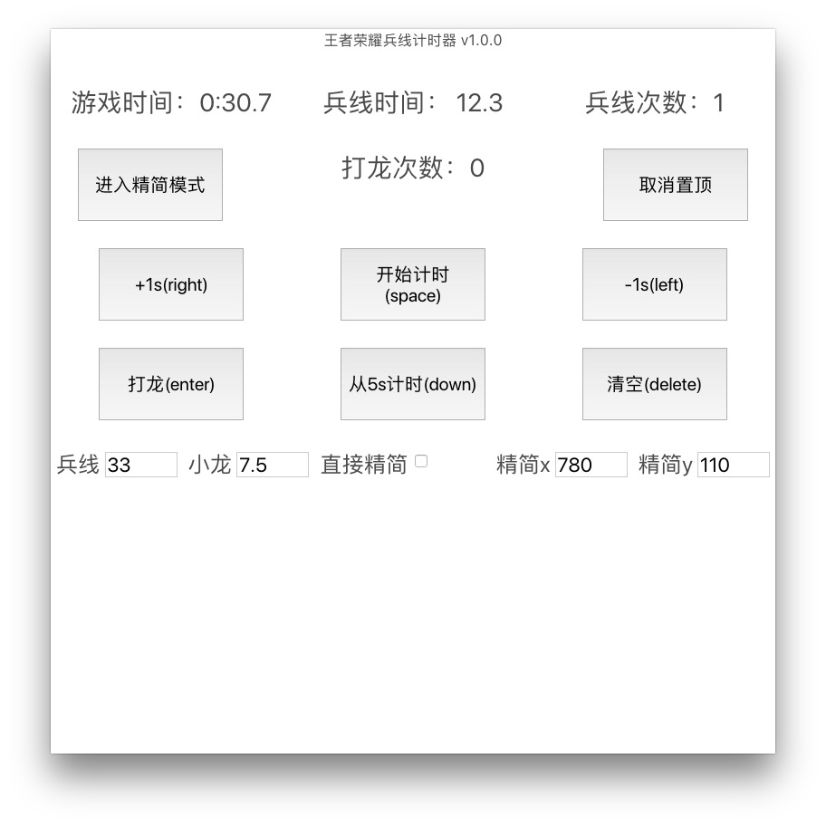
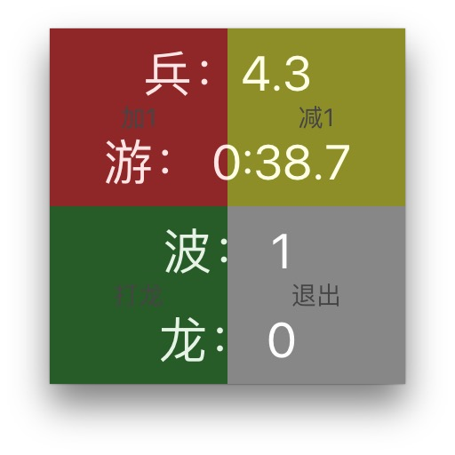

# timing-app

> timing plugin for 王者荣耀


王者荣耀兵线计时器，使用程咬金或者雅典娜玩断线流的时候，计算兵线还有多久刷新。

可以配置:

  * 兵线间隔（默认33s)
  * 打龙提前兵线时间（默认7.5s）
  * 是否直接进入精简模式
  * 精简模式在电脑屏幕中的坐标

配置模式:




精简模式





#### Build Setup

``` bash
# install dependencies
npm install

# serve with hot reload at localhost:9080
npm run dev

# build electron application for production
npm run build

# run unit & end-to-end tests
npm test


# lint all JS/Vue component files in `src/`
npm run lint

```

---

This project was generated with [electron-vue](https://github.com/SimulatedGREG/electron-vue)@[4c6ee7b](https://github.com/SimulatedGREG/electron-vue/tree/4c6ee7bf4f9b4aa647a22ec1c1ca29c2e59c3645) using [vue-cli](https://github.com/vuejs/vue-cli). Documentation about the original structure can be found [here](https://simulatedgreg.gitbooks.io/electron-vue/content/index.html).
